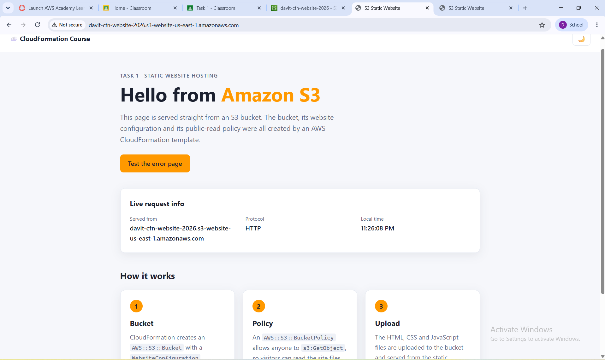

# Task 1 — Static website on S3 with CloudFormation

A CloudFormation template that creates an S3 bucket configured for static
website hosting, plus a bucket policy that makes the website files publicly
readable.

## Files

| File | Purpose |
| --- | --- |
| [`s3-static-website.yaml`](s3-static-website.yaml) | CloudFormation template: `AWS::S3::Bucket` with `WebsiteConfiguration` (`IndexDocument` / `ErrorDocument`) and `AWS::S3::BucketPolicy` |
| [`bucket-policy.json`](bucket-policy.json) | The public-read bucket policy as a standalone JSON document (same policy that the template applies) |
| [`website/`](website) | The static site: `index.html`, `error.html`, `css/style.css`, `js/script.js` |

## What the template creates

- **WebsiteBucket** (`AWS::S3::Bucket`)
  - `WebsiteConfiguration` → `IndexDocument: index.html`, `ErrorDocument: error.html`
  - `PublicAccessBlockConfiguration` turns off *policy* blocking so the public
    bucket policy can be attached (new buckets block all public access by default).
- **WebsiteBucketPolicy** (`AWS::S3::BucketPolicy`) — allows `s3:GetObject`
  for `Principal: "*"` on every object in the bucket.
- **Outputs** — `BucketName` and `WebsiteURL` (the static website hosting endpoint).

## Deploy — AWS Management Console

1. **CloudFormation → Create stack → With new resources.**
2. *Upload a template file* → choose `s3-static-website.yaml` → **Next**.
3. Stack name: e.g. `s3-static-website`.
   `BucketName`: a globally unique name, e.g. `yourname-cfn-website-2026`.
   Leave `IndexDocument` / `ErrorDocument` at their defaults → **Next** → **Next** → **Submit**.
4. Wait for `CREATE_COMPLETE`, then open the **Outputs** tab.
5. **S3 → your bucket → Upload** → *Add files* / *Add folder*: upload the
   **contents** of `website/` so the bucket root contains `index.html`,
   `error.html`, `css/` and `js/` → **Upload**.
6. **S3 → your bucket → Properties → Static website hosting** → copy the
   *Bucket website endpoint* (also shown as `WebsiteURL` in the stack outputs)
   and open it in a browser.
7. Open `<endpoint>/this-page-does-not-exist` to check the error page.

## Deploy — AWS CLI (alternative)

```bash
aws cloudformation deploy \
  --template-file s3-static-website.yaml \
  --stack-name s3-static-website \
  --parameter-overrides BucketName=yourname-cfn-website-2026

aws s3 sync website/ s3://yourname-cfn-website-2026/

aws cloudformation describe-stacks --stack-name s3-static-website \
  --query "Stacks[0].Outputs[?OutputKey=='WebsiteURL'].OutputValue" --output text
```

## Troubleshooting

- **Bucket policy fails with `AccessDenied`** — Block Public Access is probably
  enabled at the *account* level. Turn it off under
  **S3 → Block Public Access settings for this account**, then delete the
  failed stack and create it again.
- **`BucketName` already exists** — bucket names are global across all AWS
  accounts; pick another name.
- **Page loads without styles** — upload the *contents* of `website/`, not
  the `website` folder itself, so the paths are `css/style.css` and `js/script.js`.

## Clean up

Empty the bucket first (CloudFormation cannot delete a non-empty bucket), then
delete the stack:

```bash
aws s3 rm s3://yourname-cfn-website-2026 --recursive
aws cloudformation delete-stack --stack-name s3-static-website
```

## Screenshot

Hosted at the S3 static website endpoint
`http://davit-cfn-website-2026.s3-website-us-east-1.amazonaws.com`:


