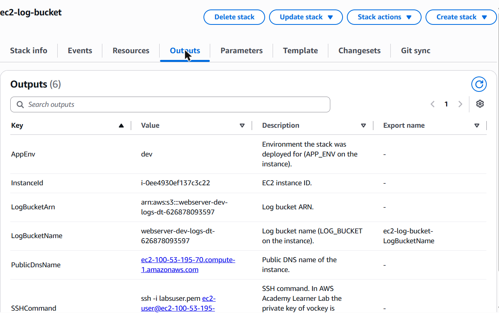
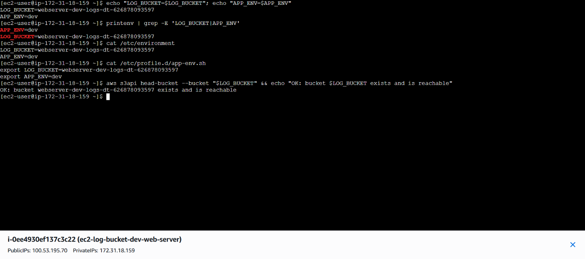

# Task 2 — EC2 instance with an S3 log bucket (LOG_BUCKET / APP_ENV)

A CloudFormation template that creates an EC2 instance and an S3 bucket for
its logs. The instance's user data runs `yum update -y` and sets two system
environment variables:

- `LOG_BUCKET`: the name of the S3 log bucket
- `APP_ENV`: the environment (`dev`, `staging` or `production`)

Nothing is hardcoded. Every value comes from a parameter, a mapping, a
condition or a pseudo parameter.

## Files

| File | Purpose |
| --- | --- |
| [`ec2-log-bucket.yaml`](ec2-log-bucket.yaml) | CloudFormation template |
| [`screenshot-ssh.png`](screenshot-ssh.png) | SSH session on the instance showing `LOG_BUCKET` and `APP_ENV` |
| [`screenshot-outputs.png`](screenshot-outputs.png) | Stack outputs: the bucket name that `LOG_BUCKET` must match |

## Template sections

All ten top-level sections are used, including every optional one:

| Section | What it does in this template |
| --- | --- |
| `AWSTemplateFormatVersion` | `2010-09-09` |
| `Transform` | `AWS::LanguageExtensions`, so that `DeletionPolicy` / `UpdateReplacePolicy` can use `Fn::If` |
| `Description` | What the stack creates |
| `Metadata` | `AWS::CloudFormation::Interface`: groups and labels the parameters in the console |
| `Parameters` | `AppEnv`, `AmiID`, `InstanceType`, `KeyName`, `InstanceProfileName`, `SSHLocation`, `LogBucketNamePrefix`, `UniqueSuffix` |
| `Rules` | `production` must use `t3.small`/`t3.medium` and must not allow SSH from `0.0.0.0/0` |
| `Mappings` | `EnvironmentConfig`: log retention per environment (7 / 30 / 365 days) |
| `Conditions` | `IsProduction`, `HasInstanceProfile` |
| `Resources` | `WebServerLogBucket`, `WebServerSecurityGroup`, `WebServerInstance` |
| `Outputs` | `AppEnv`, `LogBucketName` (exported), `LogBucketArn`, `InstanceId`, `PublicDnsName`, `SSHCommand` |

## How the requirements are met

| Requirement | Implementation |
| --- | --- |
| `AppEnv` parameter: `dev`, `staging`, `production` | `AllowedValues: [dev, staging, production]` |
| Bucket name built with `Fn::Sub`, starting with `LogBucketNamePrefix` and ending with a unique suffix | `!Sub ${LogBucketNamePrefix}-${AppEnv}-logs-${UniqueSuffix}-${AWS::AccountId}` → e.g. `webserver-dev-logs-dt-123456789012` |
| `ImageId` via `Ref` to `AmiID` | `ImageId: !Ref AmiID`. `AmiID` is an SSM parameter type that resolves to the latest Amazon Linux 2023 AMI, so no AMI ID is hardcoded |
| `InstanceType` via `Ref` | `InstanceType: !Ref InstanceType` |
| `UserData` with `Fn::Base64` + `Fn::Sub`, `yum update -y`, `LOG_BUCKET=${WebServerLogBucket}`, `APP_ENV=${AppEnv}` | The script appends both variables to `/etc/environment` (system-wide) and writes `/etc/profile.d/app-env.sh` (exported in every login shell) |

Other details:

- **Log bucket:** blocks all public access, uses SSE-S3 encryption and has a
  lifecycle rule that deletes logs after the number of days in the
  `EnvironmentConfig` mapping.
- **Deletion policy:** in `production` the bucket is `Retain`ed when the stack
  is deleted; in `dev` and `staging` it is deleted with the stack.
- **Instance profile:** the instance gets the existing Learner Lab instance
  profile `LabInstanceProfile`, so it is allowed to write to the bucket later.
  Learner Lab does not allow creating IAM roles, which is why the template
  doesn't create one. An empty `InstanceProfileName` skips it (`HasInstanceProfile`).

## Deploy (AWS Management Console)

1. Start the Learner Lab, then click **AWS** (green dot) to open the console. Region: **us-east-1**.
2. **CloudFormation → Create stack → With new resources (standard)**.
3. *Upload a template file* → `ec2-log-bucket.yaml` → **Next**.
4. Stack name: `ec2-log-bucket`. The default parameters work in Learner Lab
   (`AppEnv=dev`, `t3.micro`, `vockey`, `LabInstanceProfile`). Set `UniqueSuffix`
   to your initials → **Next**.
5. *Configure stack options*: leave as is. Under **Capabilities and
   transforms** tick all three boxes → **Next**. The console asks for them
   whenever a template has a `Transform`. `CAPABILITY_AUTO_EXPAND` is the one
   this template actually needs; it creates no IAM resources.
6. Review → **Submit**.
7. Wait for `CREATE_COMPLETE` (about 2–3 minutes) and open the **Outputs** tab.
   Give the user data another minute or two to finish `yum update`.

### Deploy with the AWS CLI (alternative)

```bash
aws cloudformation deploy \
  --template-file ec2-log-bucket.yaml \
  --stack-name ec2-log-bucket \
  --parameter-overrides AppEnv=dev UniqueSuffix=dt \
  --capabilities CAPABILITY_AUTO_EXPAND

aws cloudformation describe-stacks --stack-name ec2-log-bucket \
  --query "Stacks[0].Outputs" --output table
```

## Verify over SSH

**Option A: SSH from your computer.** In Learner Lab, open **AWS Details →
Download PEM** (saves `labsuser.pem`), then run the `SSHCommand` from the stack
outputs:

```bash
ssh -i labsuser.pem ec2-user@<PublicDnsName>
```

On Windows, if ssh complains that the key file permissions are too open, run
this once in PowerShell:
`icacls labsuser.pem /inheritance:r /grant:r "$($env:USERNAME):R"`.

**Option B: from the browser.** **EC2 → Instances →** select
`ec2-log-bucket-dev-web-server` **→ Connect → EC2 Instance Connect → Connect**.

Run on the instance:

```bash
echo "LOG_BUCKET=$LOG_BUCKET"
echo "APP_ENV=$APP_ENV"
printenv | grep -E 'LOG_BUCKET|APP_ENV'
cat /etc/environment
cat /etc/profile.d/app-env.sh
aws s3api head-bucket --bucket "$LOG_BUCKET" --no-cli-pager && echo "OK: bucket $LOG_BUCKET exists and is reachable"
```

`LOG_BUCKET` should match the `LogBucketName` output, and `APP_ENV` should be
`dev`. If the variables are empty, the user data is still running: wait for
`cloud-init status --wait` to print `status: done`, then reconnect.

## Try the Rules (optional)

Create a stack with `AppEnv=production` and keep the defaults (`t3.micro`,
SSH from `0.0.0.0/0`). CloudFormation rejects it before creating any resources:

- *The production environment must run on t3.small or t3.medium.*
- *The production environment must not allow SSH from 0.0.0.0/0.*

## Clean up

```bash
aws cloudformation delete-stack --stack-name ec2-log-bucket
```

Or use **CloudFormation → stack → Delete**. If you put files in the bucket,
empty it first (`aws s3 rm s3://<LogBucketName> --recursive`), because
CloudFormation cannot delete a non-empty bucket. A `production` bucket is
retained by design and must be deleted by hand.

## Screenshots

Stack `ec2-log-bucket` deployed with `AppEnv=dev` in us-east-1. The stack
outputs give the log bucket name `webserver-dev-logs-dt-626878093597`:



SSH session on the instance (EC2 Instance Connect). `LOG_BUCKET` holds the
same bucket name, `APP_ENV` is `dev`, and the bucket is reachable from the
instance:


